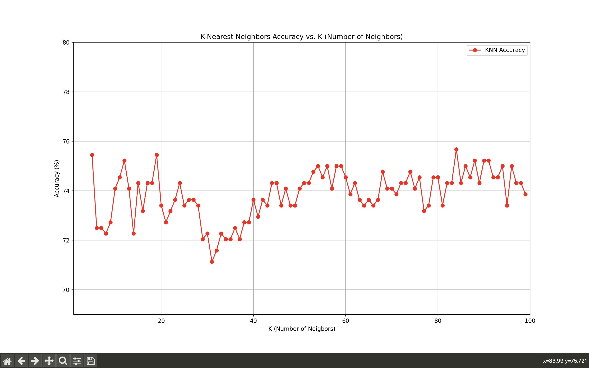
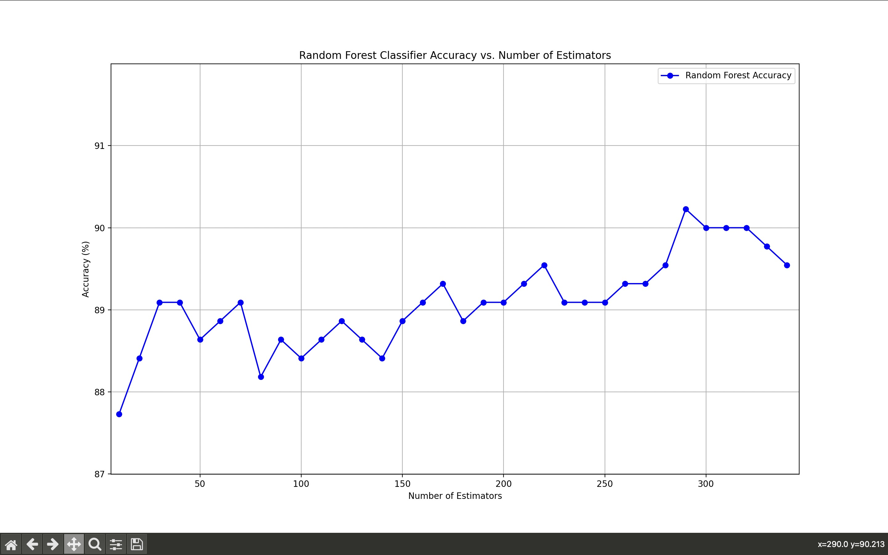

# Smart Agriculture: Predicting Water Levels for Smart Irrigation

## Introduction

This research paper focuses on implementing a Smart Irrigation System to control excessive soil water using subsurface drainage. The model uses IoT sensor data from [Kaggle](https://www.kaggle.com/datasets/nelakurthisudheer/dataset-for-predicting-watering-the-plants) and runs on a Raspberry Pi. The Microcontroller sends sensor data to the model. The goal is to predict water levels and take preventive actions to mitigate water loss.

## Model Overview

The implemented model utilizes K-Nearest Neighbors (KNN) and Random Forest algorithms to predict water levels based on IoT sensor data received from Raspberry Pi. Additionally, a third model, XGBoost, was introduced, achieving a promising accuracy of 97.27%.

### Model Performance

#### With (2200 Rows)

- KNN Accuracy: 77.95% (K = 84)
- Random Forest Accuracy: 90.23% (n_estimators = 290)
- XGBoost: 97.27%

#### Increasing Dataset Size

The model's performance showed promising results with increasing dataset size, indicating its scalability and potential for accurate predictions.

## Test Results

### K-Nearest Neighbors (KNN)

#### Graph: Accuracy vs. K

### Random Forest

#### Graph: Accuracy vs. Number of Estimators

### XGBoost

The introduction of the XGBoost model yielded a notable accuracy of 97.27%, contributing to the overall effectiveness of the Smart Irrigation System.

## Conclusion

In conclusion, the results demonstrate the effectiveness of the implemented Smart Irrigation System. The model's scalability with increasing dataset size and the introduction of XGBoost highlight its potential for accurate water level predictions.
